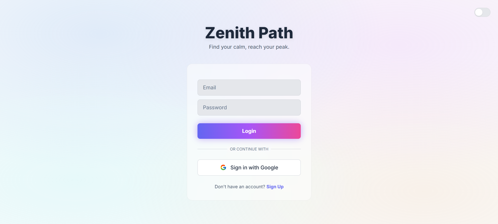
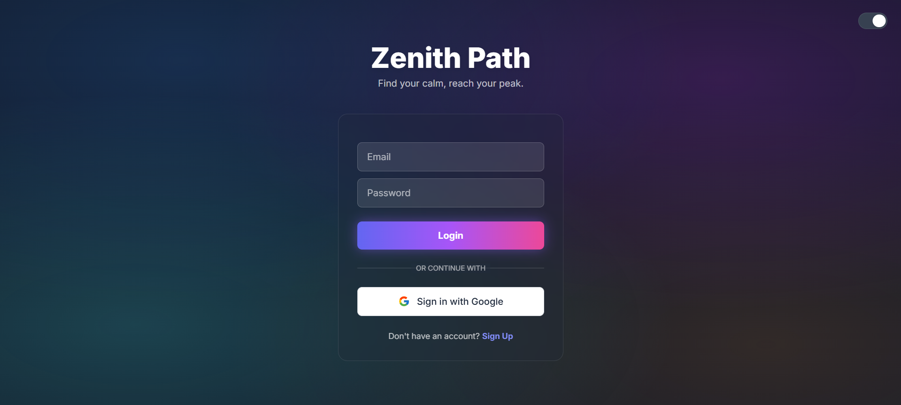
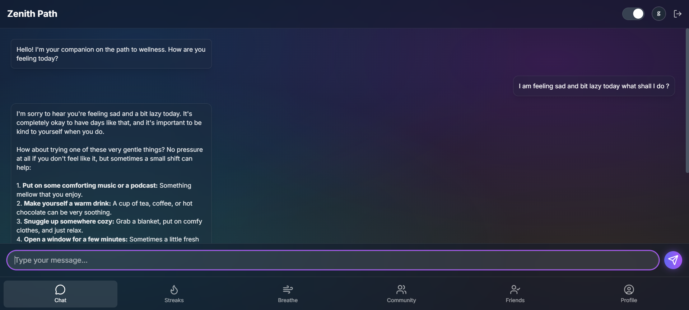
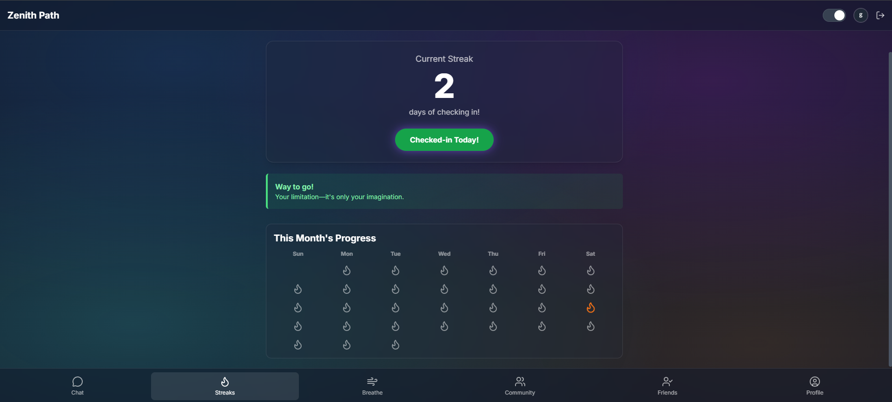
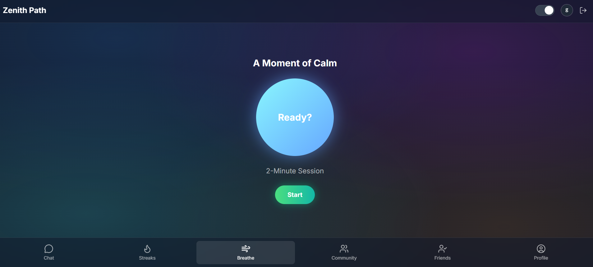
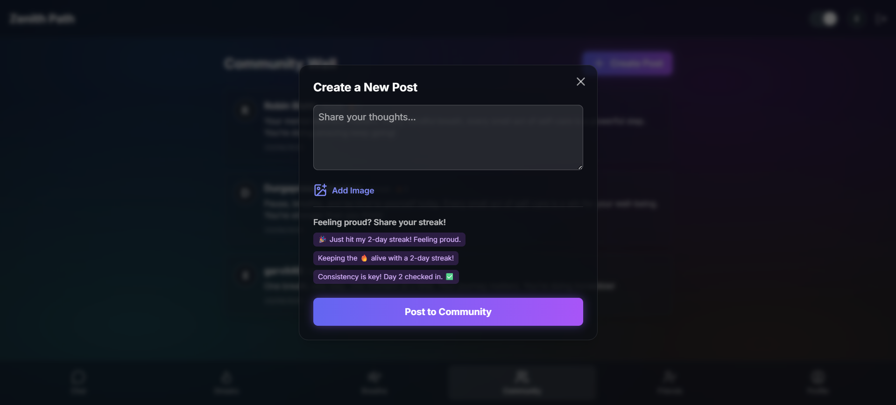
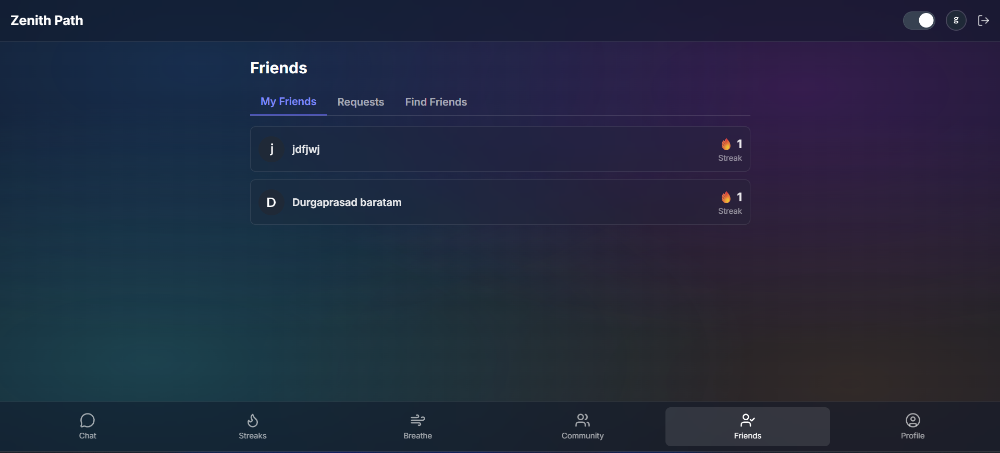
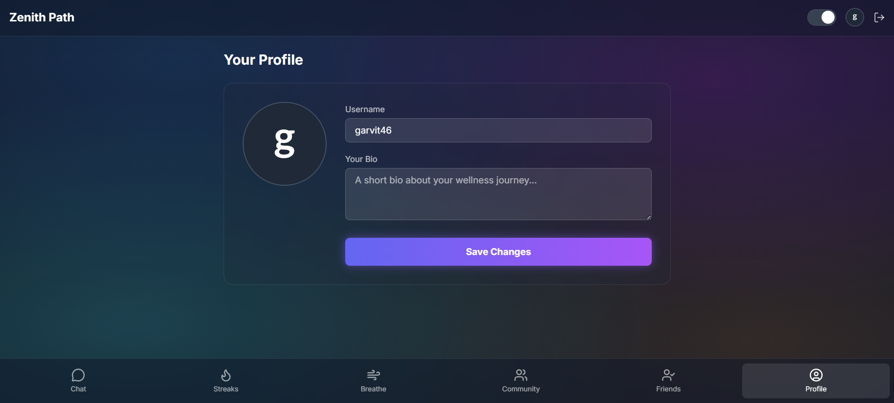

# Zenith Path 🧘✨  
Find your calm, reach your peak.  

---

## 🚀 Live Demo  
Experience Zenith Path live: [Zenith Path](https://zenithpath.netlify.app/)  

---

## 🌍 The Problem: A Silent Struggle  
In India, mental health is often a silent struggle, shrouded in stigma.  
For young adults and students, the immense pressure of academics and social life creates a heavy burden, yet seeking help is seen as a sign of weakness.  

Professional care is often inaccessible due to high costs and a lack of resources, leaving millions feeling isolated.  

👉 We built **Zenith Path** to be the first step on the journey to wellness—a private, non-judgmental space that's always available.  

---

## ✨ Our Solution: Zenith Path  
Zenith Path is an **AI-powered, confidential, and empathetic mental wellness companion** designed specifically for Indian youth.  

It’s more than just an app—it’s a supportive friend that helps users:  
- Build positive habits  
- Find a moment of calm  
- Connect with a supportive community  

Our goal is to make **mental wellness accessible and normal** in everyday life.  

---

## 📸 Screenshots  

### Light Mode  
  

### Dark Mode  
 

### AI Chatbot  
  

### Streaks & Calendar  
 

### Breathe Page  
  

### Community Feed  
  

### Friends System  
  

### Profile Page  
  

---

## 💡 The Ideation  
Our core idea: create a solution that feels **less like a clinical tool and more like a supportive companion**.  

### Principles  
1. **Anonymity & Safety First**  
   - Engage anonymously with AI chat & streaks  
   - Social features are **opt-in** for full user control  

2. **Gamification for Habit Building**  
   - Inspired by **Duolingo** streaks  
   - Rewards daily check-ins  
   - Encourages long-term positive habits  

3. **Community over Isolation**  
   - Friend system & community wall foster belonging  
   - Celebrate progress together  
   - Show users they’re **not alone**  

---

## 🚀 Key Features  
- 🤖 **Empathetic AI Chatbot** – Powered by **Google’s Gemini API**, available 24/7  
- 🔥 **Gamified Wellness Streaks** – Duolingo-style streak counter + calendar  
- 🧑‍🤝‍🧑 **Community Wall** – Share progress, thoughts & images  
- 👥 **Friends System** – Add/manage friends, view streaks  
- 🌬️ **Guided Breathing Exercises** – Instant calm during stress/anxiety  
- 👤 **Customizable Profiles** – Profile pic & bio  
- 🌗 **Dark/Light Mode Toggle** – Sleek personalized UI  

---

## 🛠️ Tech Stack  
- **Frontend:** HTML5, Tailwind CSS, Vanilla JavaScript  
- **Backend & Database:** Google Firebase (Auth, Firestore)  
- **Generative AI:** Google Gemini API  
- **UI Libraries:** GSAP (Animations), Lucide (Icons), SweetAlert2 (Notifications)  
- **Deployment:** Netlify  

---

## 🏁 Getting Started  

### Clone the repo  
```bash
git clone https://github.com/Garvitjoshi1/ZenithAI.git
cd ZenithAI/public
